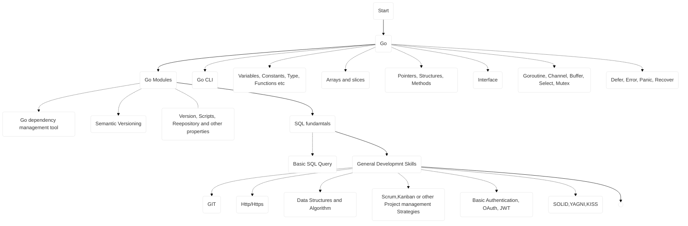

# golang-roadmap
<body style="background: #fff;">

```mermaid
%%{init: {'theme': 'base', 'themeVariables': { 'primaryColor': '#ffffff', 'textColor': '#000000', 'lineColor': '#000000', 'background' : '#bbdefb'}}}%%
graph TD;
    start(Start)-->A(Go)
    A-->B(Go Modules)
    A-.->A1(Go CLI)
    A-.->A2(Variables, Constants, Type, Functions etc)
    A-.->A3(Arrays and slices)
    A-.->A4(Pointers, Structures, Methods)
    A-.->A5(Interface)
    A-.->A6(Goroutine, Channel, Buffer, Select, Mutex)
    A-.->A7(Defer, Error, Panic, Recover)
    B-.->B1(Go dependency management tool)
    B-.->B2(Semantic Versioning)
    B-.-B3(Version, Scripts, Reepository and other properties)
    B-->C(SQL fundamtals)
    C-.->C1(Basic SQL Query)
    C-->D(General Developmnt Skills)
    D-.->D1(GIT)
    D-.->D2(Http/Https)
    D-.->D3(Data Structures and Algorithm)
    D-.->D4(Scrum,Kanban or other Project management Strategies)
    D-.->D5(Basic Authentication, OAuth, JWT)
    D-.->D6(SOLID,YAGNI,KISS)
    D-->E0(( ))

```
</body>    
