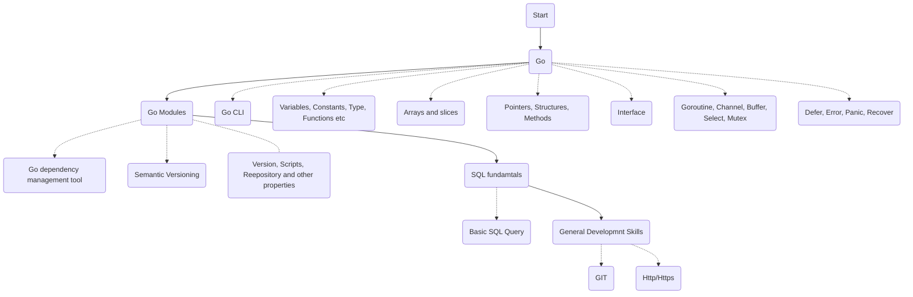

# golang-roadmap

```mermaid
graph TD;
    start(Start)-->A(Go)
    A-->B(Go Modules)
    A-.->A1(Go CLI)
    A-.->A2(Variables, Constants, Type, Functions etc)
    A-.->A3(Arrays and slices)
    A-.->A4(Pointers, Structures, Methods)
    A-.->A5(Interface)
    A-.->A6(Goroutine, Channel, Buffer, Select, Mutex)
    A-.->A7(Defer, Error, Panic, Recover)
    B-.->B1(Go dependency management tool)
    B-.->B2(Semantic Versioning)
    B-.-B3(Version, Scripts, Reepository and other properties)
    B-->C(SQL fundamtals)
    C-.->C1(Basic SQL Query)
    C-->D(General Developmnt Skills)
    D-.->D1(GIT)
    D-.->D2(Http/Https)
```
