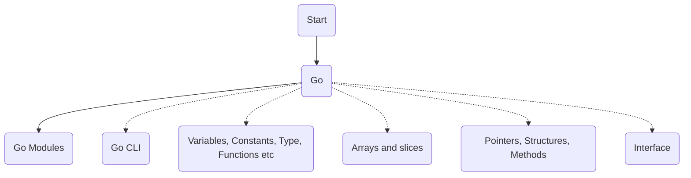

# golang-roadmap

```mermaid
graph TD;
    start(Start)-->A(Go)
    A-->B(Go Modules)
    A-.->A1(Go CLI)
    A-.->A2(Variables, Constants, Type, Functions etc)
    A-.->A3(Arrays and slices)
    A-.->A4(Pointers, Structures, Methods)
    A-.->A5(Interface)
    
```
